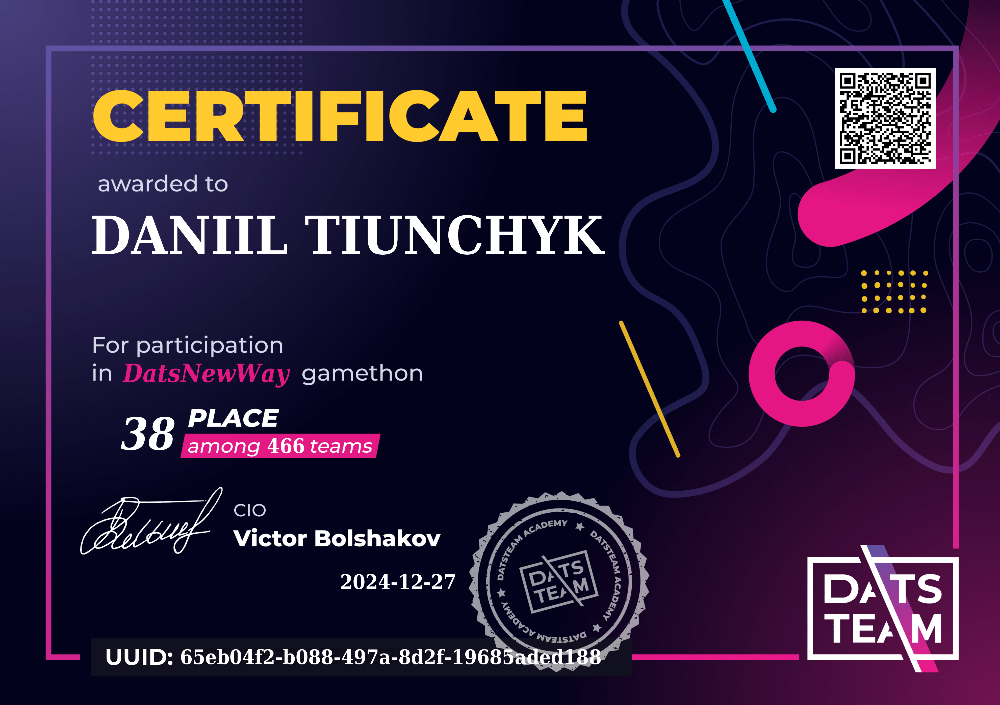
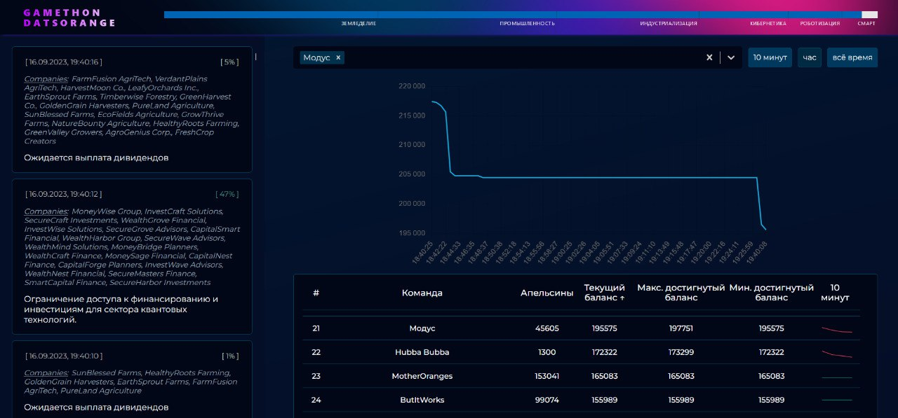

# Репозиторий проектов с хакатонов от DatsTeam

Этот репозиторий содержит проекты, созданные в рамках различных хакатонов, организованных DatsTeam. Здесь представлены описания каждого хакатона, состав команды, занятые места и визуальные материалы (картинки и сертификаты).

## Хакатоны

---

### [DatsCity](https://datsteam.dev/datscity)

**Описание хакатона:**  
DatsCity — это игра, в которой каждая минута меняет расстановку сил. Стоимость ресурсов растёт и падает, архитектурные решения влияют на поток инвестиций. Но на этом всё не заканчивается. В этом сезоне участники столкнулись с новым вызовом: построить самую высокую башню из набора слов, одно из условий звучало просто — слова можно менять, но за это игрок терял очки.

**Даты проведения:** 04.04.2025 — 05.04.2025]

**Команда:** НИИЧАВО (Научно-исследовательский институт Чародейства и Волшебства)

- [Тиунчик Даниил Романович](https://www.linkedin.com/in/daniil-tiunchyk/)
- Ставров Владислав Владимирович
- [Грибач Назар Эдуардович](https://www.linkedin.com/in/n3zza/)

---

### [DatsNewWay](https://datsteam.dev/datsnewway)

**Описание хакатона:**  
Главной задачей было управление 3D-змейкой, которая соревновалась с другими игроками за сбор мандаринов на общей карте. Карта была наполнена препятствиями и другими змейками, готовыми перехватить мандарины прямо у вас из-под носа.  

**Наш подход:**  
Мы реализовали алгоритм поиска пути A* с манхэттенской эвристикой. Алгоритм эффективно избегал столкновений с препятствиями и другими игроками, делая нашу стратегию конкурентоспособной.

Однако наше выступление оказалось слабее, чем могло быть, из-за того, что мы поздно обнаружили проблему с чудовищным пингом, вызванным использованием мобильного интернета и удалением нашего местоположения от германского сервера организаторов.

**Даты проведения:** 20.12.2024 — 21.12.2024  

**Команда:**

- [Тиунчик Даниил Романович](https://www.linkedin.com/in/daniil-tiunchyk/)  
- Марков Андрей Игоревич  
- Канонир команды РИГА

**Занятое место:** 38 из 466 команд

**Визуализация с хакатона:**  
  

**Сертификат:**  
[](./certificates/datsnewway_certificate.png)  

---

### [DatsMagic](https://datsteam.dev/datsmagic)

**Описание хакатона:**  
Научные сотрудники НИИ Чудес воплотили в реальность мечты о полётах на ковре-самолёте. И стало возможным добраться до всех сокровищ пустыни. Но, ОСТОРОЖНО! На пути есть препятствия, и вы не одни охотитесь за этими богатствами.

**Даты проведения:** 11.10.2024 — 12.10.2024

**Команда:** НИИЧАВО (Научно-исследовательский институт Чародейства и Волшебства)

- [Тиунчик Даниил Романович](https://www.linkedin.com/in/daniil-tiunchyk/)
- Ставров Владислав Владимирович
- Видук Илья Александрович

**Занятое место:** 8 из 475 команд

**Визуализация с хакатона:**  


**Сертификат:**  
[](https://devteam.games/upload/cert_5873461359.pdf)

---

### [DatsDefense](https://datsteam.dev/datsdefense?utm_source=datshackaton)

**Описание:**  
На планете случился зомби-апокалипсис. Неизвестный вирус превращает людей в зомби! Учёным удалось разработать вакцину моментального действия — она возвращает человеческий облик пострадавшим. Но за время разработки вакцины зомби стало так много, что неизвестно, удастся ли переломить ситуацию.

**Задача игроков:**  
Выжить дольше всех на карте и «вылечить» как можно больше зомби. Для этого нужно построить свою базу и придумать устойчивую к разным видам зомби конфигурацию. Стрелять в зомби антидотом, возвращая им человеческий облик, и атаковать соседние базы, чтобы очистить место для расширения своей.

**Даты проведения:** 12.07.2024 — 13.07.2024

**Команда:** Три джависта в составе коалиции против CR/LF

- [Тиунчик Даниил Романович](https://www.linkedin.com/in/daniil-tiunchyk/)
- Ставров Владислав Владимирович
- Венский Никита Александрович

**Занятое место:** 61 из 359 команд

**Визуализация с хакатона:**  


**Сертификат:**  
[](https://devteam.games/upload/cert_21075.pdf)

---

### [DatsEdenSpace](https://datsteam.dev/datsedenspace?utm_source=datshackathons)

**Описание:**  
Игроки вывозят космический мусор, чтобы спасти далёкую галактику от экологической катастрофы. У каждой команды есть космический корабль, топливо и карта. Игрокам необходимо разработать оптимальный маршрут и максимально плотно загрузить грузовой отсек корабля мусором, который похож на детали известной игры.

**Задача игроков:**  
Вывезти мусор с каждой планеты галактики, рационально загрузив его в грузовой отсек и всё это с минимальным расходом топлива.

**Даты проведения:** 05.04.2024 — 06.04.2024

**Команда:** РИГААА!

- [Тиунчик Даниил Романович](https://www.linkedin.com/in/daniil-tiunchyk/)
- Ставров Владислав Владимирович
- Канонир команды РИГА

**Занятое место:** Y из 359 команд

**Работа алгоритма с хакатона:**

Набор алгоритмов для обхода взвешенного графа из планет и загрузки трюма космического корабля мусором в виде фигур из тетриса. Алгоритм оптимизирует процесс заполнения трюма (размером 8x11) мусором, обнаруженным на орбитах различных планет, и его доставку на планету Eden.

Поиск пути:

```
    Shortest path fuel: 43
    Path: 
    Barton-122 -> Stanton-232 (fuel: 43)
```

```bash
Трюм корабля до дозагрузки:
        █     █     
        █   █ █ █   
    █   █ █ █ █ █ █ 
    █ █ █ █ █ █ █   
        █ █ █ █ █ 
        █         
                
```

Трюм корабля после дозагрузки:

```
        █ █ █ █ █ 
    █ █ █ █ █ █ █   
    █ █ █ █ █ █ █ █ 
    █ █ █ █ █ █ █   
    █ █   █ █ █ █ █ 
    █ █ █ █ █ █ █ █ 
    █ █ █ █ █ █ █ █ 
    █ █   █ █ █   █ 
    █ █ █ █ █ █ █ █ 
    █ █ █ █ █ █ █   
    █ █ █ █ █   █ █ 
```

**Сертификат:**

[](https://devteam.games/upload/cert_20325.pdf)

---

### [DatsBlack](https://datsteam.dev/datsblack)

**Описание:**  
Игроки оказываются в море с собственной парусной флотилией. Им необходимо победить в сражениях друг с другом. Сначала проходят тренировочные бои, а в финале всех ждёт Battle Royale. На вооружении у игроков есть несколько кораблей с разными техническими характеристиками, возможность сканировать пространство и карта местности со всеми опасностями (рифы, скалы, острова).

**Задача игроков:**  
Разведать местность, найти соперников, победить в сражениях или придумать другую тактику для победы, чтобы не только сохранить свою флотилию, но и набрать максимум очков.

**Даты проведения:** 23.12.2023 — 24.12.2023

**Команда:** РИГААА!

- [Тиунчик Даниил Романович](https://www.linkedin.com/in/daniil-tiunchyk/)
- Ставров Владислав Владимирович
- Канонир команды РИГА, который топил флотилии через POSTMAN

**Занятое место:** 16 из 403 команд

**Результаты тренировочных раундов:**  


**Сертификат:**  
[](https://devteam.games/upload/cert_16840.pdf)

---

### [DatsOrange](https://datsteam.dev/datsorange?utm_source=hackatonydatsteam)

**Описание:**  
Игроки становятся биржевыми брокерами и получают стартовый капитал в виде апельсинов. Их задача — приобретать и продавать акции по максимально выгодной ставке. На бирже существуют классические атрибуты: спады и подъёмы, дивиденды по акциям и конкуренция с другими игроками. Игра проходит в разные эпохи, которые последовательно сменяют друг друга: от эры земледелия до научно-технического прогресса.

**Задача игроков:**  

Грамотно распорядиться своим первоначальным капиталом и максимально увеличить своё состояние.

**Даты проведения:** 15.09.2023 — 16.09.2023

**Команда:** Модус

- [Тиунчик Даниил Романович](https://www.linkedin.com/in/daniil-tiunchyk/)
- Марков Андрей Игоревич
- Будущий канонир команды РИГА

**Занятое место:** X из 477 команд

**Визуализация с хакатона:**  


**Сертификат:**  
[](https://devteam.games/upload/cert_3447.pdf)

---

## О репозитории

Этот репозиторий содержит решения команд, в которых участвовал [Даниил Тиунчик](https://www.linkedin.com/in/daniil-tiunchyk/). В каждом проекте реализованы игровые механики и стратегии, разработанные в ходе хакатонов DatsTeam.
